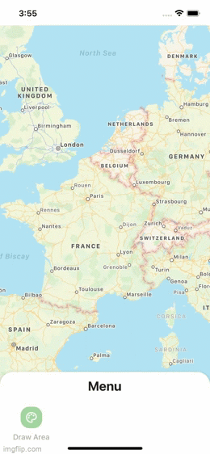

<div align="center">
  
</div>

<br>
<br>

<h1 align="center">React Native Maps Draw (Polygon)</h1>
<p align="center">Interactive drawing of polygons on the map. Beta version</p>
<h6 align="center">Made with ❤️ by developer for developers</h6>

<br>
<p align="center">


</p>


## Thanks
<p>Please, click on ⭐ button.</p>


## Installation

```bash
yarn add @dev-event/react-native-maps-draw
# or
npm install @dev-event/react-native-maps-draw
```
> Also, you need to install [react-native-gesture-handler](https://github.com/software-mansion/react-native-gesture-handler) & [react-native-svg](https://github.com/react-native-community/react-native-svg), and follow theirs installation instructions.

##  🦥 Motivation
- 💚 I love [React Native](https://reactnative.dev/)


Big love and gratitude to all people who are working on React Native, Expo and React Native Navigation!

## Usage

For more complete example open [App.tsx](https://github.com/dev-event/react-native-maps-draw/blob/main/example/src/App.tsx)

```tsx
import MapViewGestures from 'react-native-maps-draw';
import type { TTouchPoint } from 'react-native-maps-draw';
import MapView, { Polygon, Marker } from 'react-native-maps';

const AnimatedPolygon = Animated.createAnimatedComponent(Polygon);

export default function App() {
  const mapRef = useRef<MapView>(null);

  const convertByPoint = async (item: any) =>
    await mapRef.current?.coordinateForPoint(item);

  const handlePolygon = useCallback(
    (_: any, index: number) => (
      <AnimatedPolygon
        key={index}
        coordinates={polygon.polygons}
        fillColor="rgba(255, 171, 171, 0.01)"
        strokeColor="rgba(255, 171, 171, 0.88)"
        strokeWidth={1}
      />
    ),
    [polygon.polygons]
  );


  return (
    <SafeAreaView style={styles.container}>
      <MapView ref={mapRef} style={styles.map} onMapReady={handleMapReady}>
        {...rest}
      </MapView>

      {... && (
        <MapViewGestures
          points={points}
          widthLine={3}
          colorLine={'green'}
          onEndDraw={handleCanvasEndDraw}
          onChangePoints={setPoints}
          backgroundCanvas={'rgba(0, 0, 0, 0.0)'}
          convertByPoint={convertByPoint}
        />
      )}
    </SafeAreaView>
  );
}
```


## 🎉 Example

Checkout the example [here](https://github.com/dev-event/react-native-accordion).


## ✌️ Contributing

Pull requests are always welcome! Feel free to open a new GitHub issue for any changes that can be made.

## Author

Reach out to me at one of the following places!

- E-mail <a href="#" target="_blank">effectwaater@gmail.com</a>


## License

[](http://badges.mit-license.org)

- **[MIT license](http://opensource.org/licenses/mit-license.php)**
